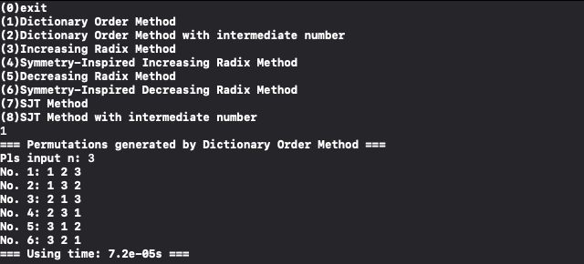

# Project 1: Permutation Generation

In this project, we research on the symmetry property of permutation generation algorithms, including Dictionary Order Method, Increasing Radix Method, Decreasing Radix Method and SJT Method.

## Files Tree

- **main.cpp**: main function of this program, generating all permutations given **n** and algorithm.

- **index2intermediate.cpp**(.hpp): generate intermediate number given index.

- **intermediate2perm.cpp**(.hpp): generate permutation given intermediate number, according to four algorithms

- **perm2next.cpp**(.hpp): generate permutations sequentially (w/o intermediate number) by Dictionary Order Method and SJT Method.

- **timing.cpp**(.hpp): analyse the cost of time of different algorithms and different **n**.

- README.md

- results

  - result1.png: permutations with **n**=3 generated by **Dictionary Order Method**

  - result2.png: permutations with **n**=3 generated by **Dictionary Order Method with intermediate number**

  - result3.png: permutations with **n**=3 generated by **Increasing Radix Method**

  - result4.png: permutations with **n**=3 generated by **Symmetry-Inspired Increasing Radix Method**

  - result5.png: permutations with **n**=3 generated by **Decreasing Radix Method**

  - result6.png: permutations with **n**=3 generated by **Symmetry-Inspired Decreasing Radix Method**

  - result7.png: permutations with **n**=3 generated by **SJT Method**

  - result8.png: permutations with **n**=3 generated by **SJT Method with intermediate number**

    

## Guideline

- Run the executable file

- Choose the algorithm

- Input  **n** 

- Get n! permutations generated by the specific algorithm and the runing time.

- Example

  

